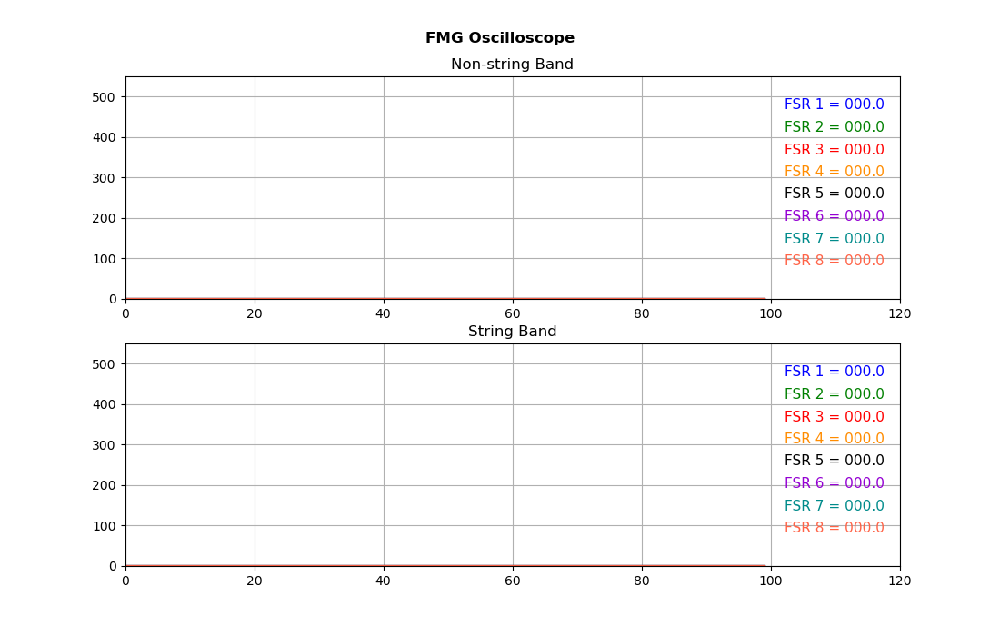
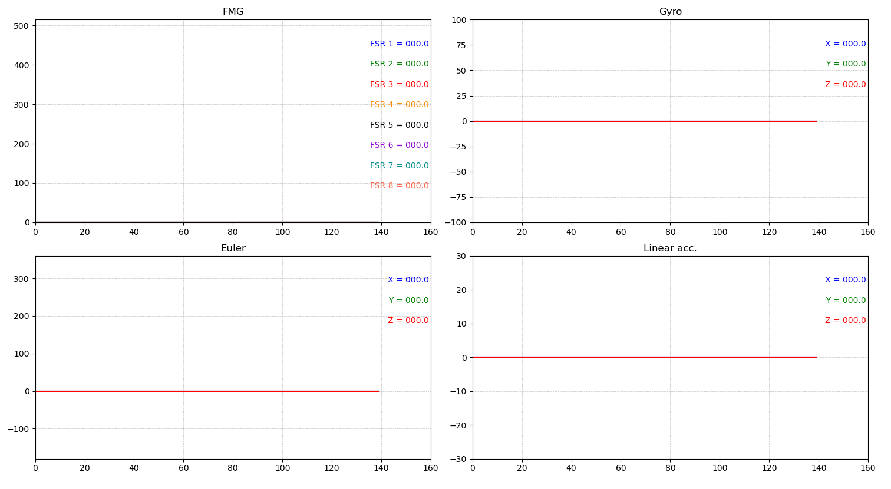

# Oscilloscope 
An oscilloscope is a type of electronic test instrument that graphically displays varying voltages of one or more signals as a function of time.

# FMG
Force myography (FMG) is a method to register the changes in the mechanical activity of muscle during contraction. Contraction leads to a change in the physical configuration of muscle like its volume, stiffness, length, etc., measured by force sensitive (or any other relevant technology) sensors. BioX bands have 8 FSRs each.

# Using FMG Oscilloscope
(File: FMG_Oscilloscope.py) The data from two BioX FMG bands is acquired by an ESP32 chip over esp-now library. This ESP32 chip's serial port name is manually configured in the code.  
(File: serial_interface_macOS.py) This files records data and saves the csv formateed data file from two bands and also serves as trigger to start/stop EMG and vision data from Delsys and Qualisys system, respectively.

# Band Oscilloscope
This file receives data from ESP chip serially and plots IMU and FMG data. Tested on MacOS.

# Setup on MacOS
1. Install PySerial library.

2. To view the available serial ports, open terminal and run following command:
ls /dev/tty.*

# Firmware Codes
## Receiver firmware
The ESP connected with PC is named as receiver.
- Open VS Code on windows PC to upload the firmware to the device.
- Change the sender's address in the receiver code.
- Change the receiver's address in the band(s).

## Sender firmware
The BioX band is named as sender.
